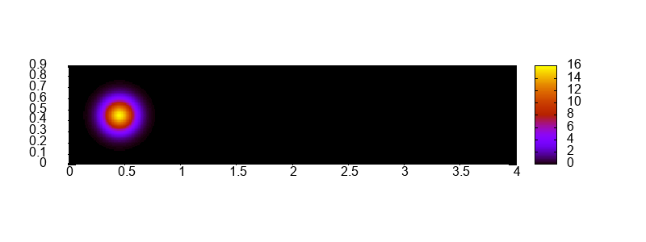

## Numerical Methods & Scientific Computing
This repository contains a collection of C++ implementations of fundamental numerical algorithms applied to physical modeling and scientific computing. The project focuses on solving ordinary and partial differential equations (ODEs/PDEs) using both classical and accelerated numerical schemes.

These implementations were developed as part of a Numerical Methods course to demonstrate proficiency in algorithmic logic, stability analysis, and data visualization (handled via Python and Gnuplot).

## Project Topics
1 – 3: ODE Solvers – Explicit (Euler, RK4) and Implicit schemes, featuring adaptive time-step control for gravitational simulations.

4 – 5: Elliptic PDEs – Solving the Poisson equation using Global/Local Relaxation and accelerating convergence via Multigrid Methods.

6: Sparse Matrices – Solving large systems of linear equations using the GMRES (Generalized Minimal Residual) algorithm.

7: Navier-Stokes Equations – Computational Fluid Dynamics (CFD) simulation using the stream function-vorticity formulation.

8: Advection-Diffusion – Numerical modeling of transport phenomena and density evolution.

10: Wave Equation – Simulation of a vibrating string and analysis of energy conservation.

## Simulation Example (Advection-Diffusion)

